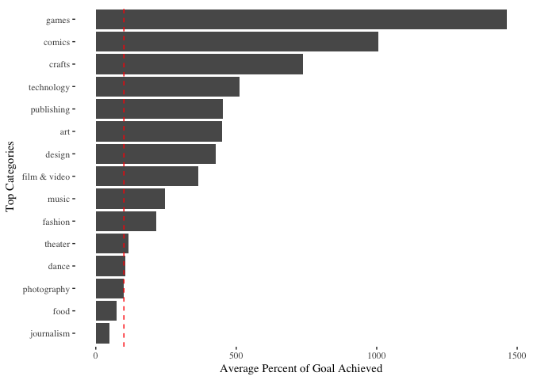
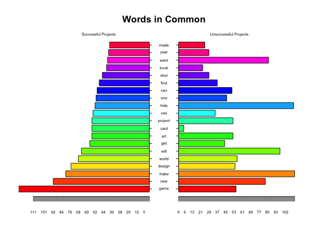
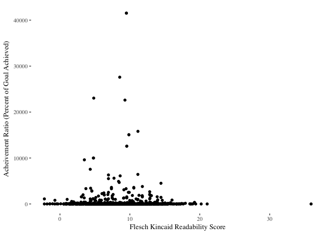
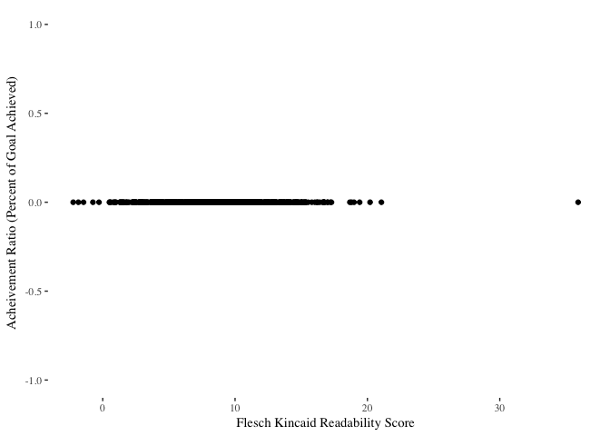
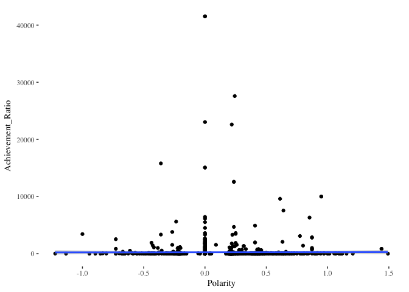

# Setup


```r
KSDS <- read.csv("~/Documents/GitHub/DV_CU_course_material/Exercises/09_kickstarter/kickstarter_projects.csv")

KSDS <- KSDS %>% mutate(Achievement_Ratio = (pledged / goal)) %>% distinct()
```


# 1. Identifying Successful Projects
## 1A. Success By Category


```r
categ <- KSDS %>% group_by(top_category) %>% summarise(ave_success = mean(na.omit(Achievement_Ratio))) %>% arrange(desc(ave_success))


ggplot(categ, mapping = aes(x = reorder(top_category, ave_success), y = ave_success * 100)) + geom_bar(stat = "identity") + coord_flip() + xlab("Top Categories") + ylab("Average Percent of Goal Achieved") + geom_hline(yintercept = 100, linetype = "dashed", color = "red", show.legend = TRUE) + theme_tufte()
```

<!-- -->

In the graph above, I added a red line to show categories where 100% of their goal was reached on average. This makes it clear that of all the categories food and Journalism are never fully funded on average.

## 2. Writing Your Success Story 

## 2A. Cleaning the Text and Word Cloud


```r
library(qdap)

success_story <- read.csv("success_story2.csv")
blurbs <- success_story %>% select(blurb)
blurbs2 <- success_story %>% select(blurb, X)


library(tm)
df_s <- DataframeSource(blurbs)
blurb_suc <- VCorpus(df_s)


clean_corpus <- function(corpus){
  corpus <- tm_map(corpus, removePunctuation)
  corpus <- tm_map(corpus, content_transformer(tolower))
  corpus <- tm_map(corpus, content_transformer(replace_symbol))
  corpus <- tm_map(corpus, removeWords, c(stopwords("en")))  
  corpus <- tm_map(corpus, removeNumbers)
  corpus <- tm_map(corpus, stripWhitespace)
  return(corpus)
}

clean_blurb <- clean_corpus(blurb_suc)

blurb_stem <- tm_map(clean_blurb, stemDocument)

library(tidytext)
blurb_dtm <- DocumentTermMatrix(blurb_stem) %>% tidy()


blurb_tf_idf <-  blurb_dtm %>%
                bind_tf_idf(term, document, count) 


library(wordcloud)
set.seed(12345)

blurb_cloud <- blurb_tf_idf %>% filter(as.numeric(document) < 1001)


wordcloud(blurb_cloud$term, blurb_cloud$tf, 
         max.words = 100, colors = "navy", scale = c(4, .5))
```

<!-- -->


## 2B. Success in Words


```r
blurb_tdm <- TermDocumentMatrix(blurb_stem)
blurb_m <- as.matrix(blurb_tdm)
blurb_df <- as.data.frame(blurb_m)

win <- blurb_df %>% select(1:1000) %>% mutate(Total_W = rowSums(blurb_df[, 1:1000]))
lose <- blurb_df %>% select(1001:2000) %>%mutate(Total_L= rowSums(blurb_df[, 1001:2000]))
win <- win %>% select(Total_W)
lose <- lose %>% select(Total_L)

w_l <- cbind(win, lose, blurb_tdm$dimnames$Terms) 
top20 <- w_l %>% arrange(desc(Total_W)) %>% head(n = 20)

difference <- abs(top20$Total_W - top20$Total_L)
top20 <- cbind(top20, difference)

library(plotrix)

pyramid.plot(top20$Total_W, top20$Total_L, labels = top20$`blurb_tdm$dimnames$Terms`, 
             gap = 14, main = "Words in Common", top.labels = c("Successful Projects", " ",
                                                                "Unsuccessful Projects"),
             laxlab = NULL, raxlab = NULL, unit = NULL, labelcex=0.5)
```

<!-- -->

```
## [1] 5.1 4.1 4.1 2.1
```

## 2C. Simplicity as a Virtue


```r
library(quanteda)
qblurb <- corpus(blurb_suc)
qblurb <- textstat_readability(qblurb, measure = c('Flesch.Kincaid'))
simplicity <- data_frame(FK = qblurb$Flesch.Kincaid,
                         Ratio = success_story$Achievement_Ratio)

ggplot(simplicity, aes(x = FK, y = Ratio)) + geom_point() + theme_tufte() + xlab('Flesch Kincaid Readability Score') + ylab('Acheivement Ratio (Percent of Goal Achieved)')
```

<!-- -->

Looking at the graph above, it could be argued that a blurb with a Flesch Kincaid score in between approximately 4 and 15 proves to be most successful. However, looking below it is clear that their are numerous examples with scores from 0 to 20 that acheived none of their goal. 


```r
ggplot(simplicity, aes(x = FK, y = Ratio)) + geom_point() + theme_tufte() + xlab('Flesch Kincaid Readability Score') + ylab('Acheivement Ratio (Percent of Goal Achieved)') + coord_cartesian(ylim = c(-1, 1))
```

<!-- -->


# 3. Sentiment

## 3A. Stay Positive


```r
library(tidytext)
library(qdap)

colnames(blurbs2) <- c("text", "doc_id")


sentiment <- polarity(blurbs2$text, blurbs2$doc_id)
sent_graph <- cbind(sentiment$all$doc_id, sentiment$all$polarity, success_story$Achievement_Ratio)
sent_graph <- tidy(sent_graph)

colnames(sent_graph) <- c("Blurb_Num", "Polarity", "Achievement_Ratio")
sent_graph <- cbind(sent_graph, success_story$blurb)
ggplot(sent_graph, aes(y = Achievement_Ratio, x = Polarity)) + geom_point() + geom_smooth(method = "lm") + theme_tufte()
```

<!-- -->

Looking at the graph above there is perhaps a very slight positive relationship between Acheivement Ratio and Polarity, but its overall affect seems negligible. 

## 3B. Positive vs Negative


```r
pos_doc <- as.numeric(sent_graph$Polarity) > 0
pos_blurb <- sent_graph[pos_doc, ]
neg_blurb <- sent_graph[!pos_doc, ]

sent_graph <- mutate(sent_graph, group = pos_doc)

pos_b <- DataframeSource(pos_blurb)
pos_corpus <- VCorpus(pos_b)

pos_dtm <- DocumentTermMatrix(pos_corpus)

sent_graph %>% filter(group == TRUE) %>% select()
```

```
## data frame with 0 columns and 938 rows
```

```r
pos_m <- as.matrix(pos_dtm)
pos_df <- as.data.frame(pos_m)
```

## 3C. Get in Their Mind


