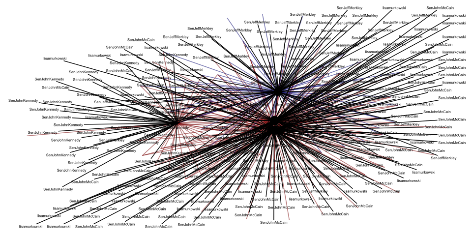
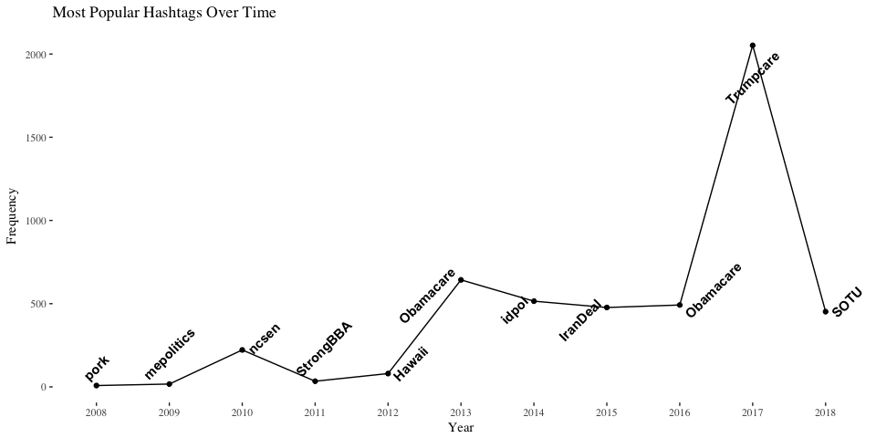
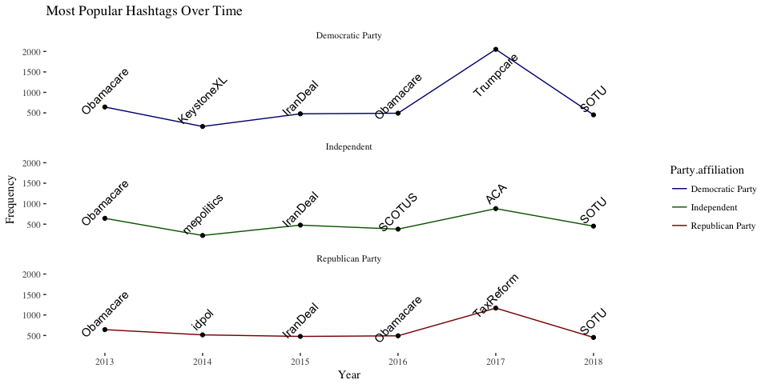
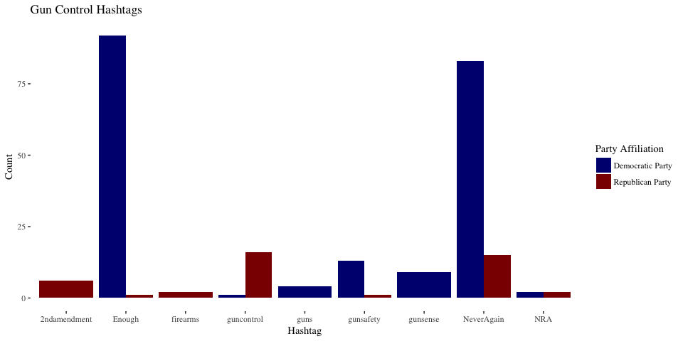
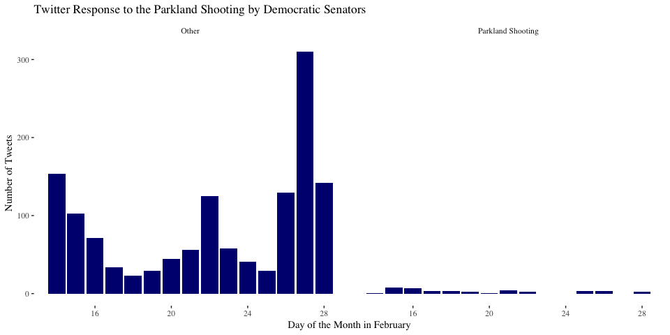
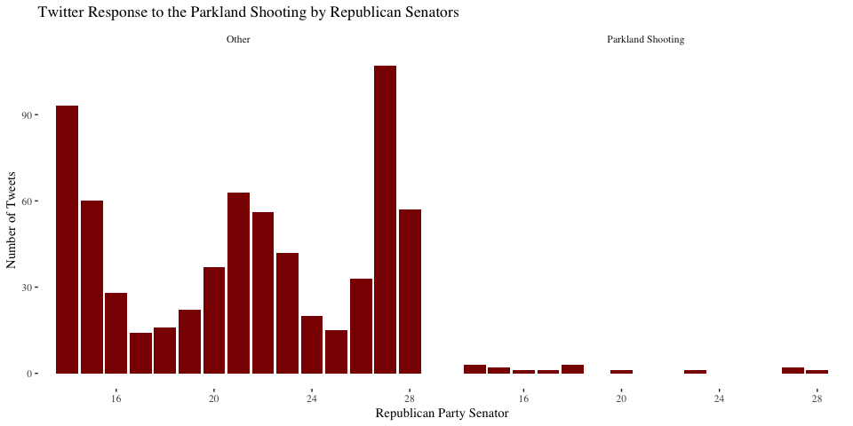
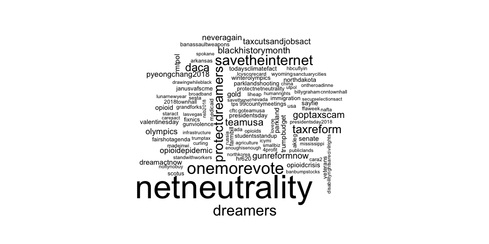
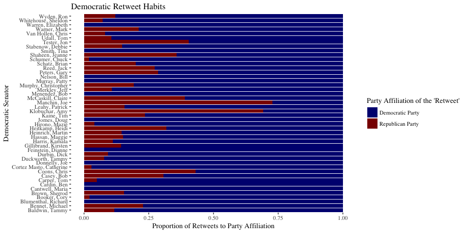
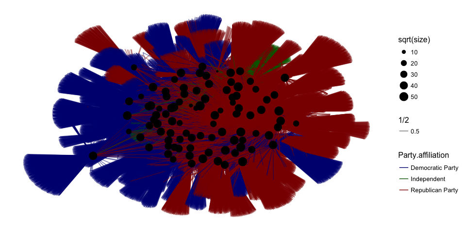

# 1. Who follows whom?

## 1A) Network of Followers

<!-- -->
As mentioned on Piazza, it seems as though the obvious obscurity that comes along with this network even when diluted to just the three highest indegree senators and the three highest out degree senators was part of the point of the exercise. I feel the need to mention that the edge colors match the appropriate party, and the node size varies by centrality -- not that one could easily tell by looking. 

## 1B) Communities

<!--html_preserve-->

<!--/html_preserve-->

There was probably a better kind of graph to use to visualize whether cluster_walktrap captured party alignment. However, I was eager to practice creating a d3 network, and so that is what I have created here. Even though it maybe be a bit less obvious, it is still apparent that the graph captured at least some of the party alignment.

# 2. What are they tweeting about?

## 2A) Most Common Topics over Time

<!-- -->

To visualize tweets over time, I chose to visualize the most common hashtags over the past 10 years, by year. 

## 2B) Democrats VS Republicans

<!-- -->

In order to have representation of all parties I subset the data to only include tweets from the last 5 years. I then plotted it in a similar way as the previous graph and facet wrapped the graphs by party. 

## 2C) Gun Control I - Dems vs. Reps

<!-- -->

## 2D) Gun Control II - Parkland Shooting

I couldn't decide which way was best to present this information, so I created several. I decided to look at twitter communication following the attack starting the day after (February 15th) and ending at the end of the month. I figured this could be a good way to capture any sentiment. I then chose to rename the hashtags: "StonemanShooting, stonemanshooting, Parkland, FloridaSchoolShooting, GunReformNow, ParklandShooting" as a group to be "Parkland Shooting," and I renamed all other hashtags "other."  I then created two faceted graphs demonstrating how often the "Parkland Shooting" group was used in a hashtag in relation to the "other" category, one for each party. As is apparent, in comparison to eveything else that was tweeted about, the Parkland Shooting was very infrequently referenced. To further demonstrate this point I provided a word cloud showing the 100 most frequent hashtags from February 15th to the end of the month. This shows that dreamers, daca, immigration, and the olympics, were perhaps more prevalently portrayed via these senators twitter hashtags.

<!-- --><!-- --><!-- -->

# 3. Are you talking to me?

## 3A) Identifying Re-Tweets

For this question, I created a simple percentage barchart based on how often a given senator retweets his or her given party or their opposite. In order to more clearly illustrate this, I chose to make two graphs, one for Republicans and one for Democrats, instead of faceting. 

<!-- --><!-- -->

## 3B) Identifying Mentions

Im not sure exactly what happened here. I had a very difficult time getting the graph to do what I wanted! 
<!-- -->
